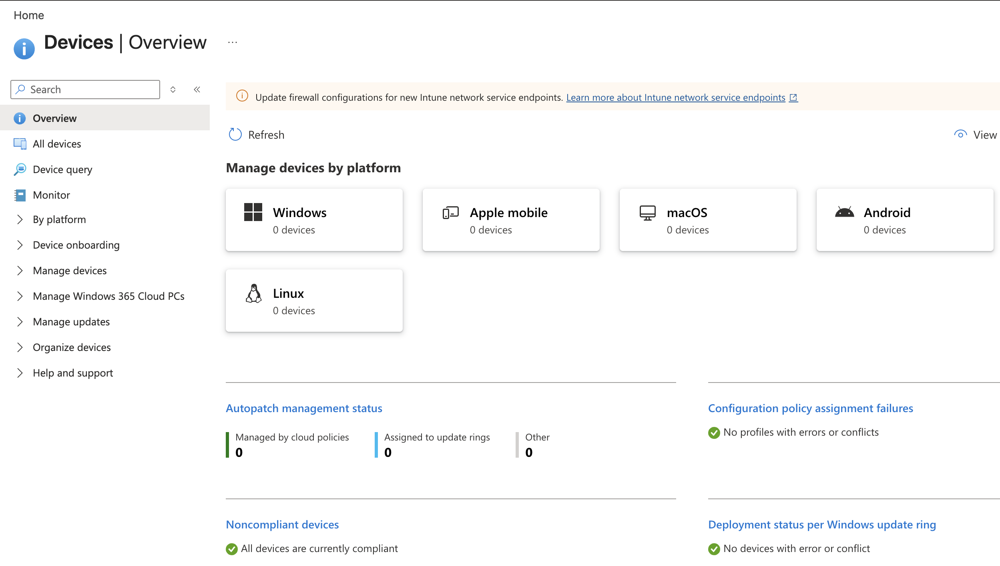
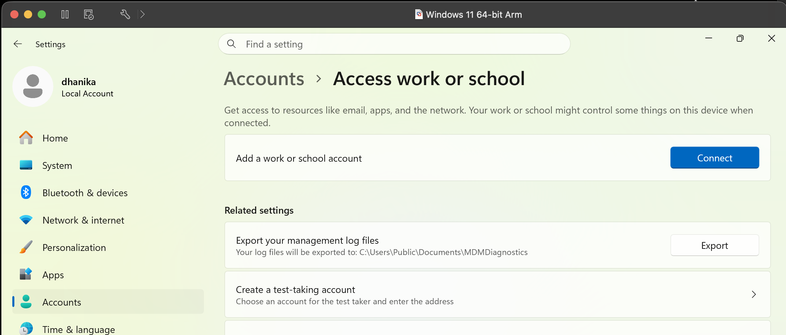
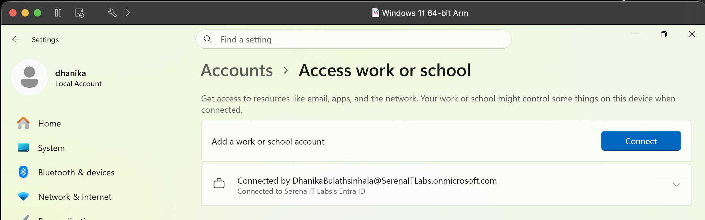
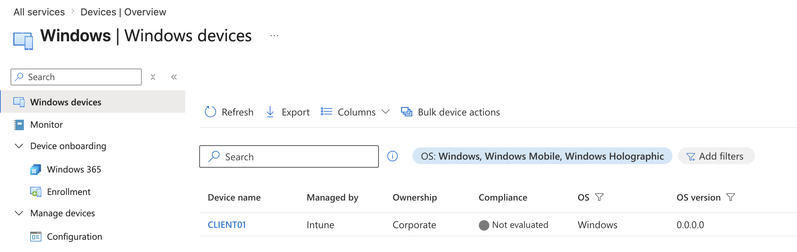
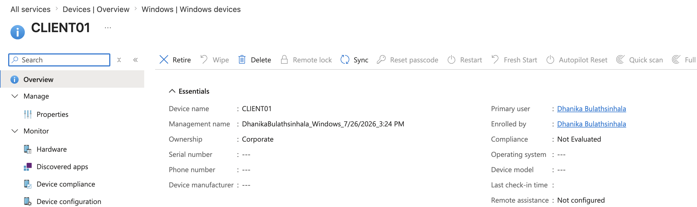
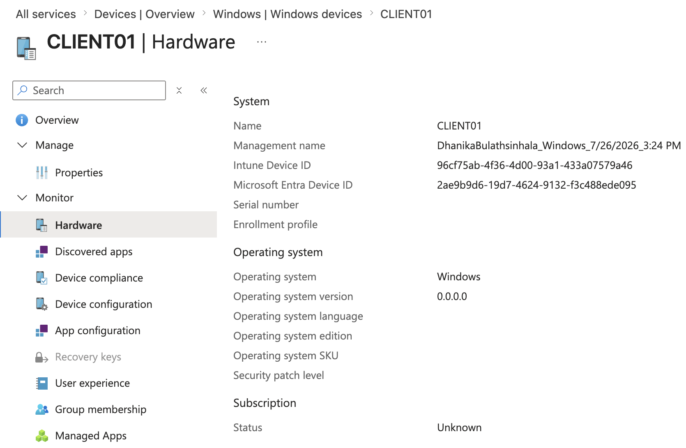
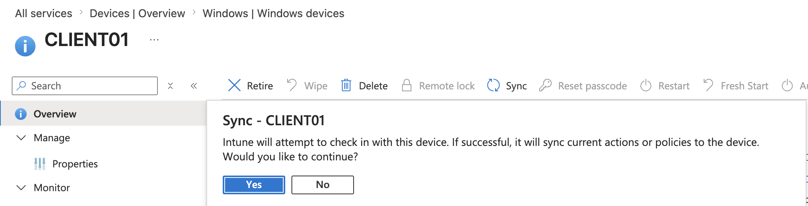

# Project 01 – Windows 11 Enrollment & Device Management

## Overview

This project demonstrates the enrollment and administration of a Windows 11 endpoint using Microsoft Intune and Microsoft Entra ID.

A Windows 11 virtual machine (`CLIENT01`) was Microsoft Entra joined, enrolled into Microsoft Intune, verified through the Intune Admin Center, and remotely synchronized.

The lab also included troubleshooting a failed automatic MDM enrollment using Windows identity and device-management diagnostic tools.

---

## Scenario

An organization is introducing Microsoft Intune for centralized endpoint management.

As the endpoint administrator, the objective was to onboard a Windows 11 workstation into Microsoft Entra ID and Microsoft Intune, verify that the device was correctly managed, review its hardware inventory, and test a basic remote management action.

During deployment, the device successfully joined Microsoft Entra ID but initially failed to enroll into Intune. The enrollment issue was investigated and resolved before completing the deployment.

---

## Objectives

- Join a Windows 11 endpoint to Microsoft Entra ID
- Configure automatic Intune MDM enrollment
- Enroll the endpoint into Microsoft Intune
- Verify device management status
- Review endpoint hardware inventory
- Perform a remote device synchronization
- Troubleshoot a failed MDM enrollment
- Verify Windows identity and authentication state

---

## Lab Environment

| Component | Details |
|---|---|
| Endpoint | CLIENT01 |
| Operating System | Windows 11 |
| Virtualization | VMware Fusion |
| Host Platform | macOS |
| Identity Platform | Microsoft Entra ID |
| Endpoint Management | Microsoft Intune |
| Licensing | Microsoft 365 Business Premium |
| Enrollment | Automatic MDM Enrollment |
| MDM User Scope | All |

---

## Project Structure

```text
01-Windows-11-Enrollment-and-Device-Management/
├── README.md
└── Screenshots/
    ├── 01_Devices_Before_Enrollment.png
    ├── 02_Access_Work_or_School.png
    ├── 03_Microsoft_Entra_Joined.png
    ├── 04_Device_Enrolled_in_Intune.png
    ├── 05_Managed_Device_Overview.png
    ├── 06_Device_Hardware_Inventory.png
    └── 07_Device_Remote_Sync.png
```

---

# Windows 11 Enrollment

## Initial Intune Device State

The Intune device inventory was reviewed before enrollment to establish the initial state of the environment.



---

## Work or School Connection

The Windows 11 endpoint was prepared for organizational enrollment through the Windows **Access work or school** settings.



---

## Microsoft Entra Join

`CLIENT01` was joined to the organization's Microsoft Entra ID tenant.

The device registration state was verified using:

```cmd
dsregcmd /status
```

The resulting device state confirmed:

```text
AzureAdJoined : YES
```



---

# Microsoft Intune Enrollment

## Managed Device Enrollment

Automatic MDM enrollment was configured through Microsoft Intune with the MDM user scope assigned to eligible organizational users.

Following successful enrollment, `CLIENT01` appeared in the Intune managed-device inventory.



---

## Managed Device Overview

The endpoint was reviewed through the Microsoft Intune Admin Center to verify its management state and device information.

The device overview provides administrators with centralized visibility into properties such as operating system, ownership, compliance state, primary user, and management status.



---

## Hardware Inventory

Intune collected hardware and operating-system information from the enrolled endpoint.

This information can assist IT Support teams with endpoint inventory, troubleshooting, lifecycle management, and asset-management activities.



---

## Remote Device Synchronization

A remote **Sync** action was initiated from Microsoft Intune.

Device synchronization instructs the managed endpoint to check in with Intune and retrieve applicable policies, configurations, and management instructions.



---

# Enrollment Troubleshooting

During the initial deployment, `CLIENT01` successfully joined Microsoft Entra ID but did not appear as a managed device in Microsoft Intune.

Rather than repeating the enrollment process without investigation, the Windows enrollment state was systematically examined.

## Diagnostic Process

### 1. Verified Microsoft Entra Join

The following command was used:

```cmd
dsregcmd /status
```

The device reported:

```text
AzureAdJoined : YES
```

This confirmed that the Microsoft Entra join itself had succeeded.

### 2. Checked MDM Discovery

The `MdmUrl` value was initially unavailable and was later populated after the licensed organizational account established the appropriate Windows session.

This helped distinguish Microsoft Entra registration from Intune MDM enrollment.

### 3. Verified Primary Refresh Token

The authentication state was reviewed and confirmed:

```text
AzureAdPrt : YES
```

This demonstrated that the organizational user had obtained a Microsoft Entra Primary Refresh Token.

### 4. Reviewed MDM Configuration

Automatic enrollment settings were verified with:

```text
MDM user scope: All
```

The Intune-licensed organizational account was therefore within the configured automatic enrollment scope.

### 5. Investigated Event Viewer

The following Windows log was examined:

```text
Applications and Services Logs
└── Microsoft
    └── Windows
        └── DeviceManagement-Enterprise-Diagnostics-Provider
            └── Admin
```

An MDM PolicyManager event indicated a previous invalid or stale enrollment state.

### 6. Checked Automatic Enrollment Tasks

The Windows `EnterpriseMgmt` scheduled-task location was examined to determine whether automatic MDM enrollment had been successfully triggered.

The expected enrollment task was initially absent.

### 7. Performed Clean Re-enrollment

A local administrator account was established as a recovery account before disconnecting the organizational connection.

The previous Entra connection was removed, the endpoint was restarted, and `CLIENT01` was cleanly joined to Microsoft Entra ID again using the licensed organizational account.

The device subsequently completed Intune enrollment successfully.

---

## Troubleshooting Outcome

The exercise demonstrated an important distinction between:

```text
Microsoft Entra Join
        │
        ▼
Device Identity
        │
        ▼
MDM Discovery
        │
        ▼
Intune Enrollment
        │
        ▼
Managed Endpoint
```

A device being Microsoft Entra joined does not by itself prove that Intune MDM enrollment has completed successfully.

Verifying the join state, authentication state, MDM discovery information, enrollment logs, and scheduled tasks provided a structured method for identifying where the enrollment workflow had failed.

---

## Skills Demonstrated

- Microsoft Intune administration
- Windows 11 endpoint enrollment
- Microsoft Entra Join
- Automatic MDM enrollment
- Windows device management
- Intune device inventory
- Hardware inventory
- Remote device synchronization
- `dsregcmd` diagnostics
- Primary Refresh Token verification
- Windows Event Viewer analysis
- MDM enrollment troubleshooting
- Local administrator recovery
- Endpoint onboarding
- Microsoft 365 endpoint administration

---

## Key Lessons

- Microsoft Entra Join and Microsoft Intune enrollment are separate stages of endpoint onboarding.
- `dsregcmd /status` is useful for validating device identity, tenant connectivity, MDM discovery, and authentication state.
- A populated MDM discovery URL indicates that Windows has received MDM enrollment information.
- `AzureAdPrt` can help verify the authentication state of the organizational user.
- Device Management event logs provide valuable information when MDM enrollment fails.
- Maintaining a local administrative recovery account is useful when troubleshooting device identity and enrollment.
- Intune provides centralized device inventory and remote management capabilities for enrolled endpoints.
- Successful troubleshooting requires identifying which stage of the enrollment workflow failed rather than repeatedly attempting enrollment.

---

## Next Project

**Project 02 – Windows Configuration & Compliance**

The next project will configure and deploy Intune policies to `CLIENT01`, including device configuration and compliance requirements, and verify their application on the managed endpoint.

---

**Status:** Completed