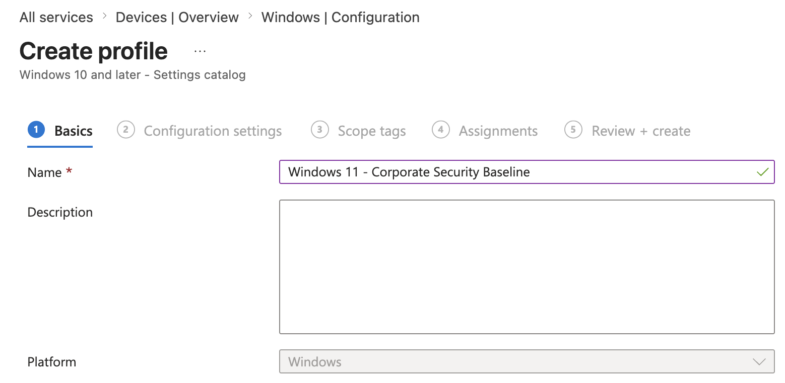
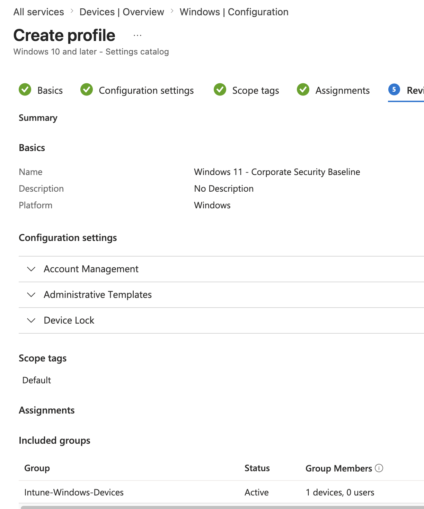
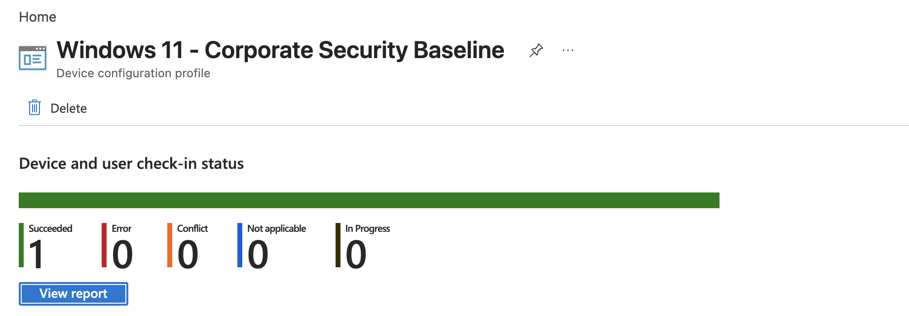
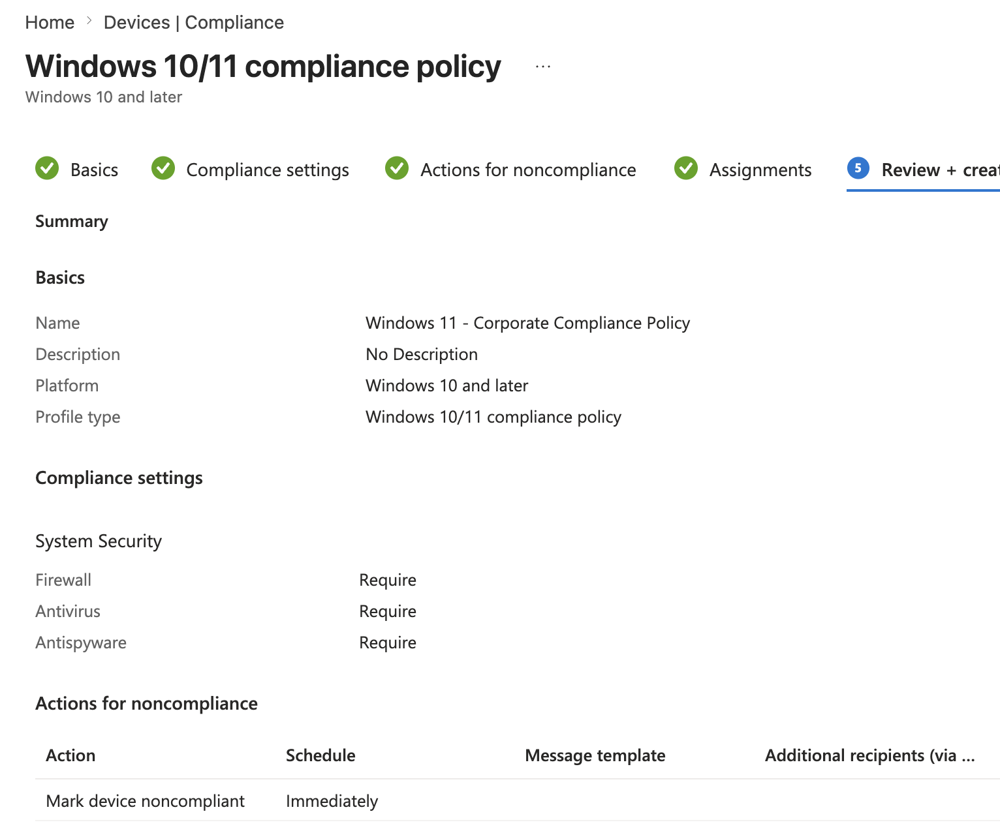
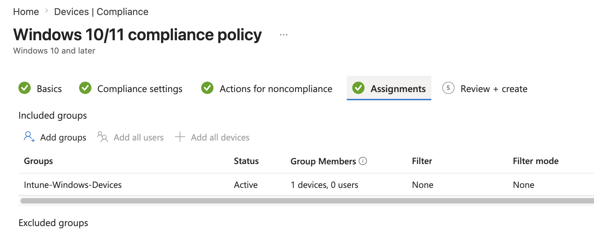
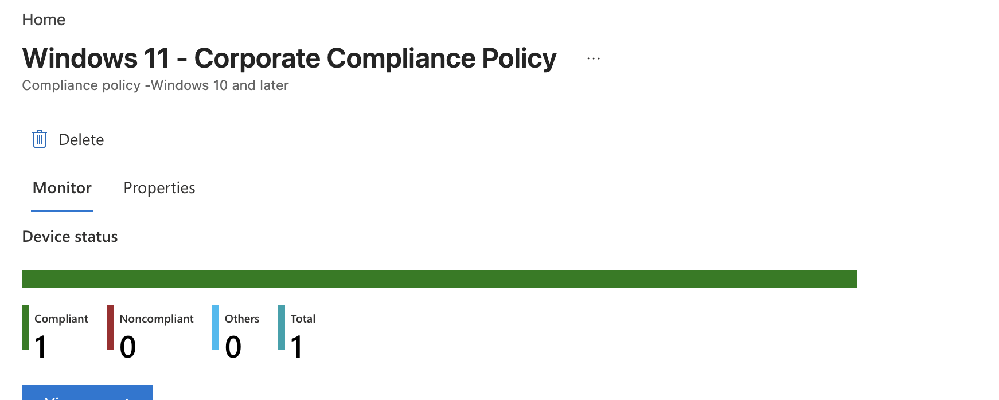

# Project 02 – Windows Configuration & Compliance

## Overview

This project demonstrates Windows endpoint configuration and compliance management using Microsoft Intune.

The lab focused on creating a Windows configuration profile, assigning it to an Intune-managed device group, verifying successful policy deployment to `CLIENT01`, creating a Windows compliance policy, and confirming that the managed endpoint met the configured compliance requirements.

---

## Scenario

An organization requires centrally managed Windows endpoints to follow a standard configuration and meet defined security requirements.

As the Intune administrator, the task was to create and deploy a Windows configuration profile, apply it to a managed device group, define compliance requirements, and verify that the Windows 11 endpoint successfully received the configuration and was evaluated as compliant.

---

## Objectives

- Create a Windows configuration profile
- Configure practical Windows settings
- Create a device-targeting security group
- Assign the configuration profile to managed devices
- Verify policy deployment
- Create a Windows compliance policy
- Configure security-related compliance requirements
- Assign the compliance policy
- Verify device compliance status

---

## Lab Environment

| Component | Details |
|---|---|
| Endpoint | CLIENT01 |
| Operating System | Windows 11 |
| Endpoint Management | Microsoft Intune |
| Identity Platform | Microsoft Entra ID |
| Device Group | Intune-Windows-Devices |
| Configuration Type | Settings Catalog |
| Compliance Platform | Windows 10 and later |
| Environment | Microsoft 365 Business Premium Tenant |

---

## Project Structure

```text
02-Windows-Configuration-and-Compliance/
├── README.md
└── Screenshots/
    ├── 01_Configuration_Profile_Created.png
    ├── 02_Configuration_Profile_Assignment.png
    ├── 03_Configuration_Profile_Status.png
    ├── 04_Compliance_Policy_Settings.png
    ├── 05_Compliance_Policy_Assignment.png
    └── 06_CLIENT01_Compliance_Status.png
```

---

# Windows Configuration Profile

## Profile Creation

A Windows configuration profile was created using the Microsoft Intune **Settings Catalog**.

The profile was designed to apply a small set of centrally managed Windows settings without duplicating security controls reserved for the dedicated Endpoint Security project.



---

## Device Group Assignment

A security group named:

`Intune-Windows-Devices`

was created and `CLIENT01` was added as a device member.

The configuration profile was assigned to this group rather than directly to an individual endpoint.

This demonstrates scalable group-based Intune policy targeting.



---

## Configuration Deployment Status

After the policy was assigned, `CLIENT01` was synchronized with Microsoft Intune.

The device check-in status was reviewed to confirm that the configuration profile had been processed by the endpoint.



---

# Windows Compliance Policy

## Compliance Requirements

A Windows compliance policy named:

`Windows 11 - Corporate Compliance Policy`

was created.

The policy included practical endpoint security requirements such as:

- Firewall enabled
- Antivirus protection enabled
- Antispyware protection enabled

Hardware-dependent requirements that could create artificial failures in the VMware lab environment were intentionally left unconfigured.



---

## Compliance Policy Assignment

The compliance policy was assigned to the same:

`Intune-Windows-Devices`

security group.

Using the same device group provides consistent targeting across configuration and compliance policies.



---

## Compliance Verification

Following policy assignment and device synchronization, `CLIENT01` was evaluated against the configured compliance requirements.

The endpoint successfully reported as:

`Compliant`

This confirmed that the device satisfied the security requirements defined in the Intune compliance policy.



---

## Configuration and Compliance Workflow

```text
Managed Windows Device
        │
        ▼
Intune-Windows-Devices Group
        │
        ├──── Configuration Profile
        │          │
        │          ▼
        │     Windows Settings
        │
        └──── Compliance Policy
                   │
                   ▼
             Security Evaluation
                   │
                   ▼
                Compliant
```

---

## Skills Demonstrated

- Microsoft Intune administration
- Windows configuration profiles
- Settings Catalog
- Device-group targeting
- Microsoft Entra security groups
- Intune policy assignment
- Policy deployment monitoring
- Windows compliance policies
- Endpoint compliance evaluation
- Antivirus compliance
- Firewall compliance
- Antispyware compliance
- Device synchronization
- Endpoint security administration

---

## Lessons Learned

- Intune configuration profiles provide centralized control over Windows endpoint settings.
- Device groups allow policies to be assigned consistently across multiple endpoints.
- Configuration deployment status should be verified after policy assignment rather than assuming successful application.
- Compliance policies evaluate whether managed endpoints meet organizational security requirements.
- Configuration policies and compliance policies serve different purposes and can be used together.
- Hardware-specific compliance requirements should be selected carefully in virtualized lab environments.
- Device synchronization can be used to accelerate policy retrieval and compliance evaluation.
- A successful compliance result confirms that the endpoint currently meets the configured requirements.

---

## Next Project

**Project 03 – Application & Update Deployment**

The next project focuses on deploying software to `CLIENT01`, monitoring application installation status, configuring Windows update management, and verifying deployment from the Intune Admin Center.

---

**Status:** Completed