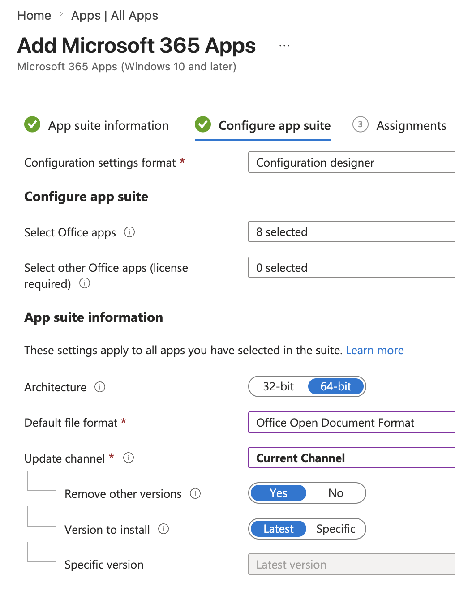
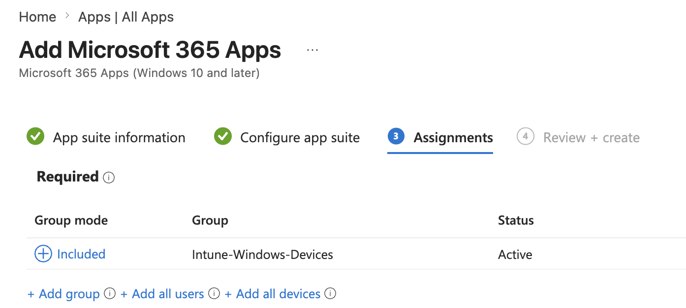
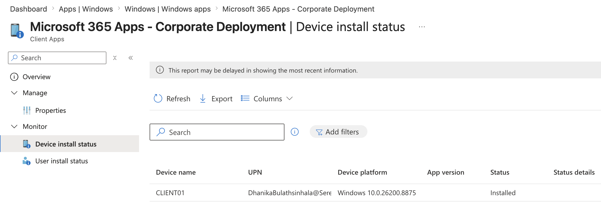
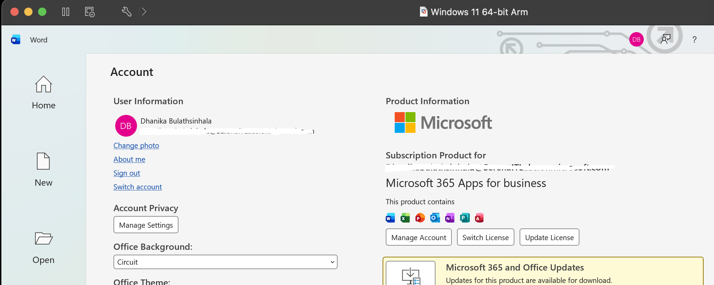
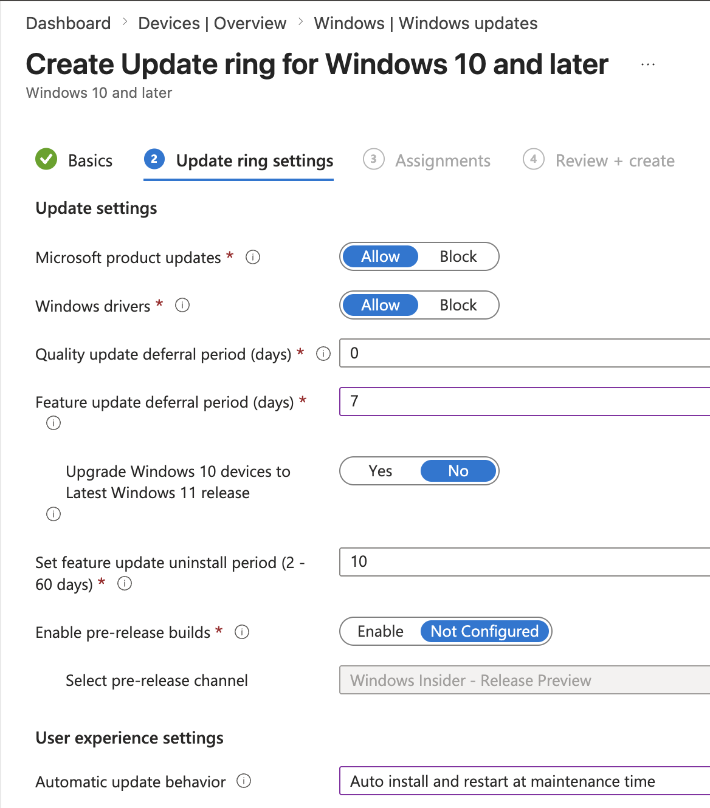
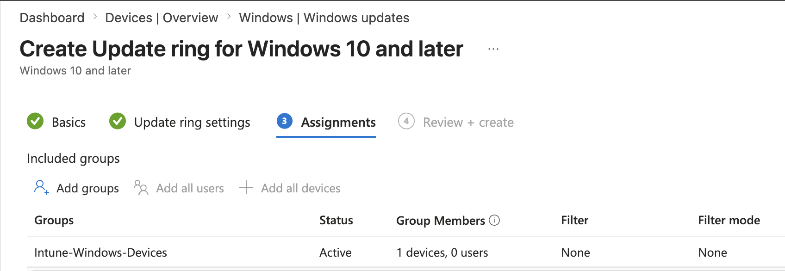
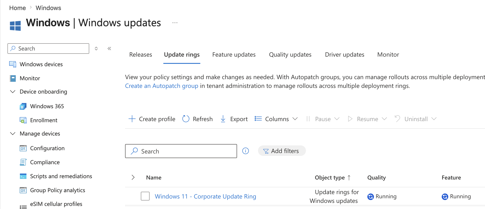

# Project 03 – Application & Update Deployment

## Overview

This project demonstrates centralized application deployment and Windows Update management using Microsoft Intune.

The lab focused on deploying Microsoft 365 Apps to the managed Windows 11 endpoint `CLIENT01`, verifying successful installation, creating a Windows Update Ring, assigning the update policy to a device group, and monitoring deployment status.

---

## Scenario

An organization requires standardized software and centrally managed Windows updates across corporate endpoints.

As the Intune administrator, the task was to deploy Microsoft 365 productivity applications to a managed Windows device and configure a Windows Update Ring to control how Windows updates are delivered.

---

## Objectives

- Deploy applications through Microsoft Intune
- Configure Microsoft 365 Apps for Windows
- Assign applications to a managed device group
- Monitor application deployment status
- Verify application installation on the endpoint
- Create a Windows Update Ring
- Configure update behaviour
- Assign update policies to managed devices
- Monitor Windows Update policy deployment

---

## Lab Environment

| Component | Details |
|---|---|
| Endpoint | CLIENT01 |
| Operating System | Windows 11 |
| Endpoint Management | Microsoft Intune |
| Identity Platform | Microsoft Entra ID |
| Device Group | Intune-Windows-Devices |
| Application | Microsoft 365 Apps |
| Update Management | Windows Update Rings |
| Environment | Microsoft 365 Business Premium Tenant |

---

## Project Structure

```text
03-Application-and-Update-Deployment/
├── README.md
└── Screenshots/
    ├── 01_Microsoft_365_App_Configuration.png
    ├── 02_Application_Assignment.png
    ├── 03_Application_Deployment_Status.png
    ├── 04_Application_Verified_on_CLIENT01.png
    ├── 05_Update_Ring_Settings.png
    ├── 06_Update_Ring_Assignment.png
    └── 07_Update_Ring_Deployment_Status.png
```

---

# Application Deployment

## Microsoft 365 Apps Configuration

A managed Microsoft 365 Apps deployment was created in Microsoft Intune.

The deployment included core productivity applications such as Word, Excel, PowerPoint, Outlook, OneNote, and Teams.



---

## Application Assignment

The Microsoft 365 Apps deployment was assigned as a required application to:

`Intune-Windows-Devices`

Using group-based assignment allows software to be deployed consistently to managed endpoints without configuring each device individually.



---

## Deployment Monitoring

The application deployment status was monitored through the Intune Admin Center.

`CLIENT01` successfully reported the Microsoft 365 Apps deployment as installed.



---

## Endpoint Verification

The installation was also verified directly on `CLIENT01`.

Microsoft 365 applications were available on the Windows endpoint following the Intune deployment.



---

# Windows Update Management

## Update Ring Configuration

A Windows Update Ring named:

`Windows 11 - Corporate Update Ring`

was created to centrally control Windows Update behaviour.

The policy included settings for:

- Microsoft product updates
- Windows drivers
- Quality updates
- Feature update deferral
- Automatic update behaviour
- Feature update rollback period



---

## Update Ring Assignment

The update policy was assigned to:

`Intune-Windows-Devices`

This ensures that managed Windows endpoints within the group receive the organization's Windows Update configuration.



---

## Update Deployment Monitoring

The Windows Update Ring deployment was monitored through Microsoft Intune.

`CLIENT01` received the update policy and Windows began processing applicable update activity according to the configured policy.



---

## Deployment Workflow

```text
CLIENT01
   │
   ▼
Intune-Windows-Devices
   │
   ├── Microsoft 365 Apps
   │       │
   │       ▼
   │   Required Deployment
   │       │
   │       ▼
   │     Installed
   │
   └── Windows Update Ring
           │
           ▼
       Update Policy
           │
           ▼
      Device Processing
```

---

## Skills Demonstrated

- Microsoft Intune administration
- Application deployment
- Microsoft 365 Apps deployment
- Required application assignment
- Device-group targeting
- Application installation monitoring
- Endpoint-side application verification
- Windows Update Rings
- Windows update policy management
- Feature and quality update configuration
- Device synchronization
- Endpoint deployment monitoring

---

## Lessons Learned

- Microsoft Intune can centrally deploy applications to managed Windows endpoints.
- Required application assignments allow software to install automatically on targeted devices.
- Deployment status should be verified both through Intune and directly on the endpoint.
- Device groups provide scalable targeting for software and update policies.
- Windows Update Rings allow administrators to centrally control update behaviour.
- Feature and quality update settings can be managed separately.
- Intune deployment reporting provides visibility into application and update-policy status.
- Application deployment can take longer than configuration-profile deployment because software must be downloaded and installed on the endpoint.

---

## Next Project

**Project 04 – Endpoint Security**

The next project focuses on Microsoft Defender Antivirus, Windows Firewall, disk encryption, and endpoint security policy management through Microsoft Intune.

---

**Status:** Completed