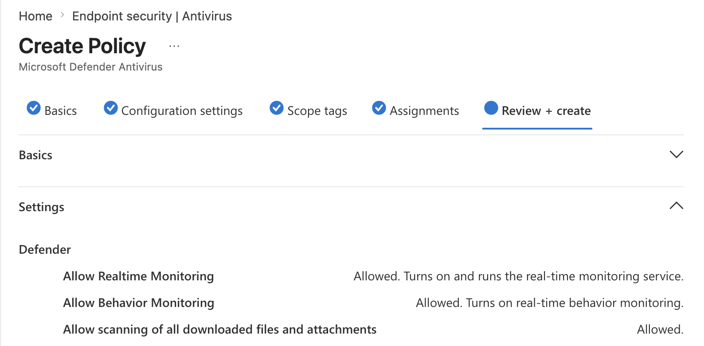
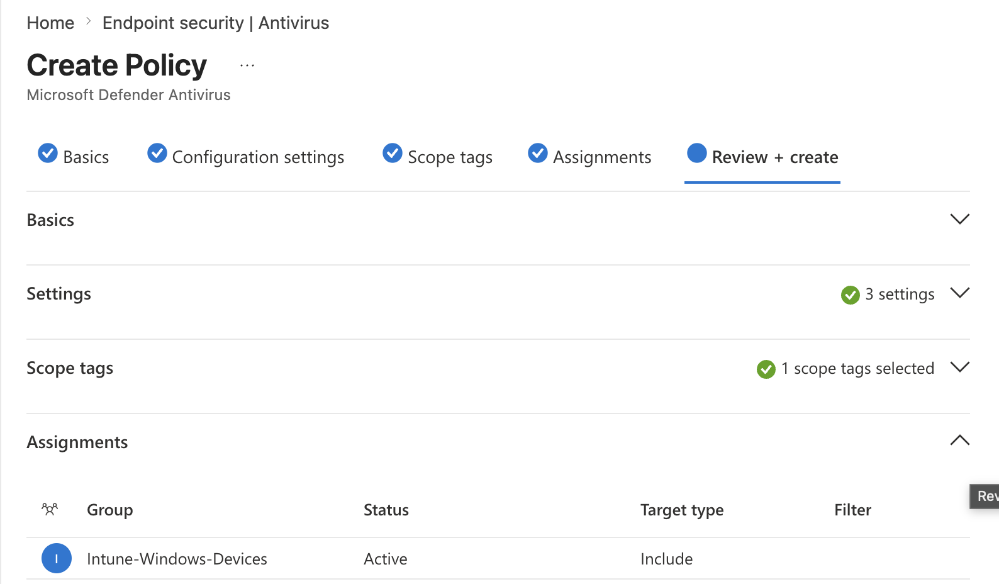
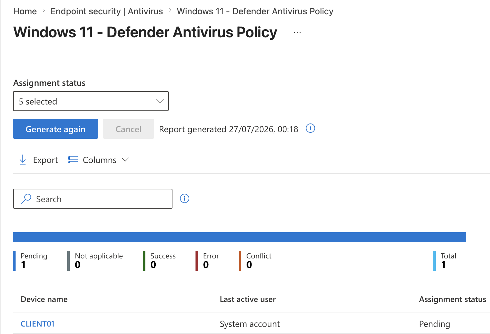
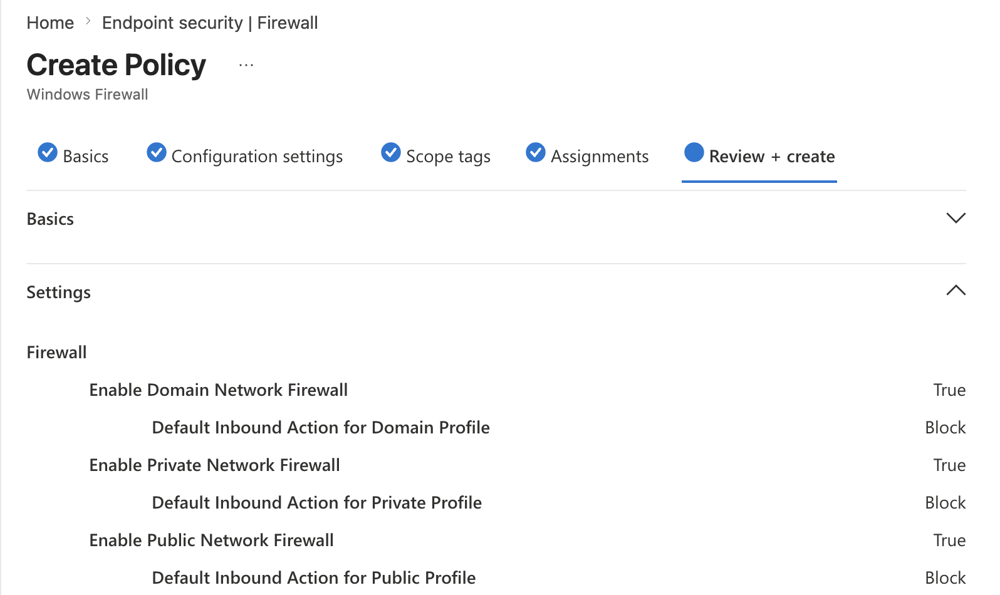
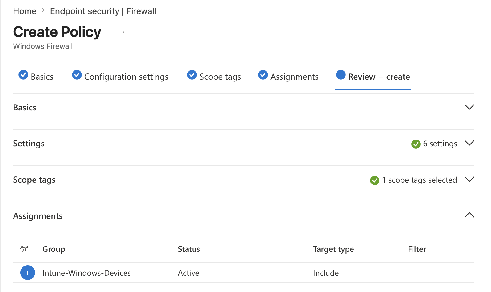
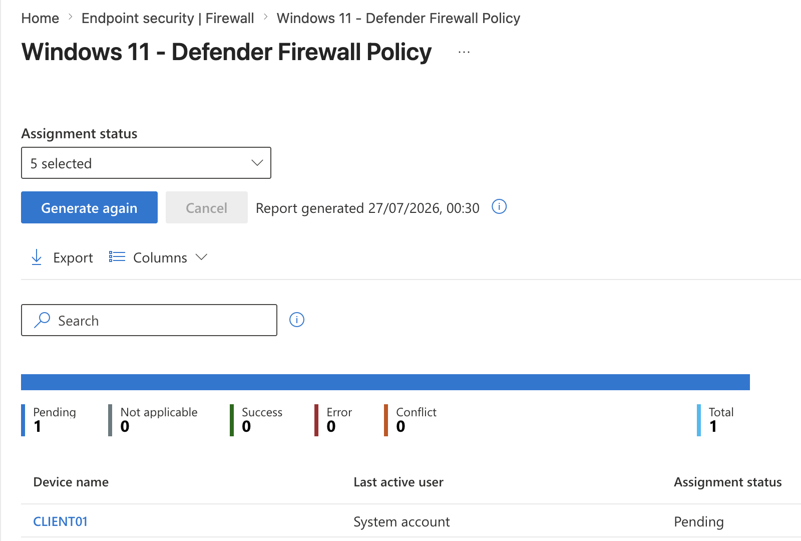
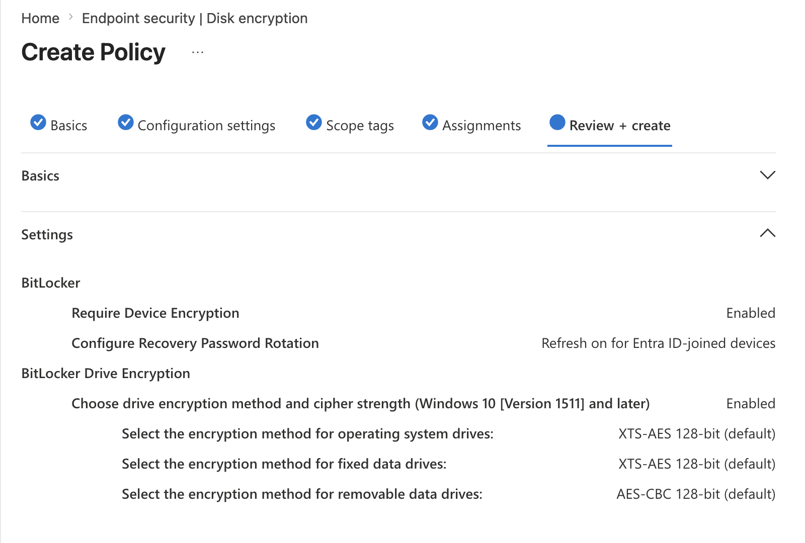
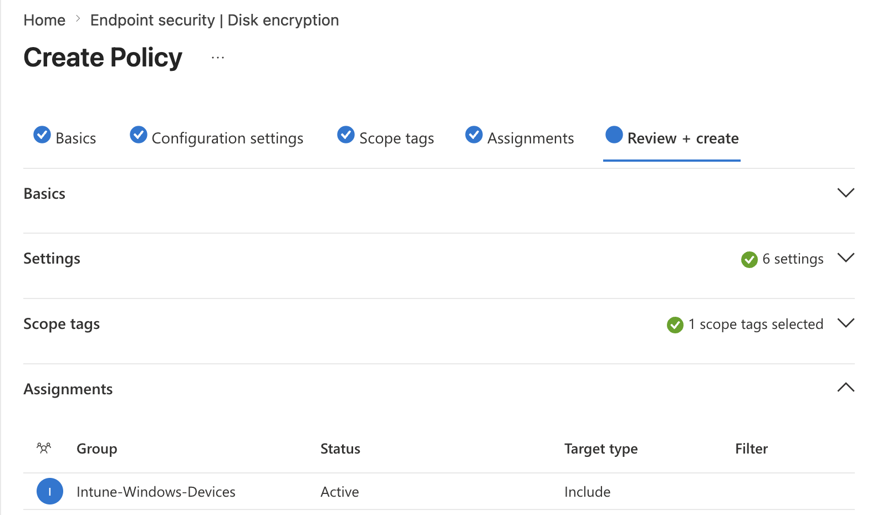
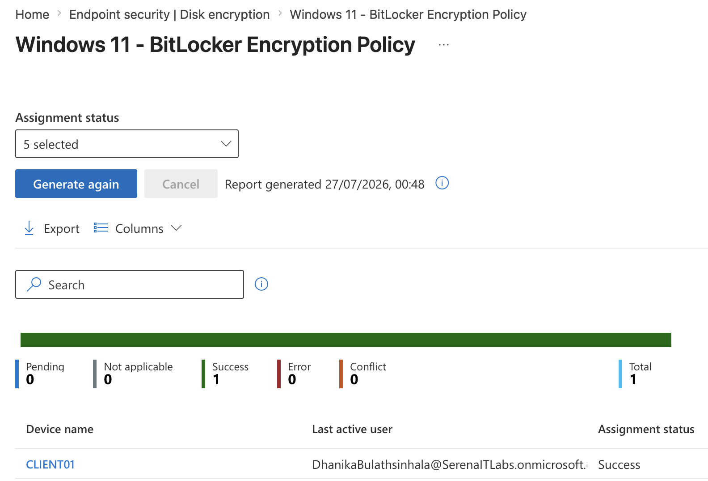
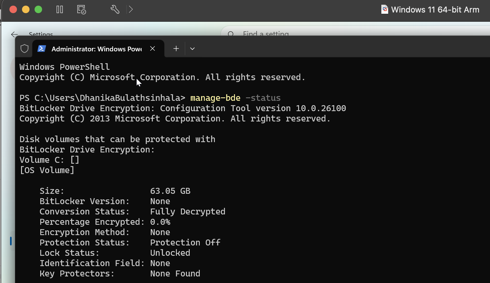

# Project 04 – Endpoint Security

## Overview

This project demonstrates endpoint security policy management using Microsoft Intune.

The lab focused on configuring and deploying Microsoft Defender Antivirus, Microsoft Defender Firewall, and BitLocker encryption policies to the managed Windows 11 endpoint `CLIENT01`.

The project also verified policy deployment through Intune and confirmed endpoint-side security configuration where applicable.

---

## Scenario

An organization requires centrally managed Windows endpoints to meet a standard endpoint-security baseline.

As the Intune administrator, the task was to configure antivirus protection, firewall enforcement, and disk encryption policies, assign them to managed Windows devices, and verify their deployment and security state.

---

## Objectives

- Configure Microsoft Defender Antivirus
- Enable real-time and cloud-delivered protection
- Configure Windows Defender Firewall
- Enforce firewall protection across network profiles
- Configure BitLocker disk encryption
- Store recovery information through organizational identity services where supported
- Assign security policies using device groups
- Monitor policy deployment
- Verify endpoint security status on `CLIENT01`

---

## Lab Environment

| Component | Details |
|---|---|
| Endpoint | CLIENT01 |
| Operating System | Windows 11 |
| Endpoint Management | Microsoft Intune |
| Identity Platform | Microsoft Entra ID |
| Device Group | Intune-Windows-Devices |
| Antivirus | Microsoft Defender Antivirus |
| Firewall | Microsoft Defender Firewall |
| Encryption | BitLocker |
| TPM | Available |
| Environment | VMware Fusion / Microsoft 365 Business Premium |

---

## Project Structure

```text
04-Endpoint-Security/
├── README.md
└── Screenshots/
    ├── 01_Defender_Antivirus_Settings.png
    ├── 02_Defender_Antivirus_Assignment.png
    ├── 03_Defender_Antivirus_Status.png
    ├── 04_Defender_Firewall_Settings.png
    ├── 05_Defender_Firewall_Assignment.png
    ├── 06_Defender_Firewall_Status.png
    ├── 07_BitLocker_Policy_Settings.png
    ├── 08_BitLocker_Policy_Assignment.png
    ├── 09_BitLocker_Policy_Status.png
    └── 10_CLIENT01_BitLocker_Verification.png
```

---

# Microsoft Defender Antivirus

## Antivirus Policy Configuration

A Microsoft Defender Antivirus policy was created for managed Windows endpoints.

The policy included security settings such as:

- Real-time protection
- Behaviour monitoring
- Cloud-delivered protection
- Potentially unwanted application protection
- Scanning of downloaded files and attachments



---

## Antivirus Policy Assignment

The Defender Antivirus policy was assigned to:

`Intune-Windows-Devices`

Using a device-based security group provides consistent policy deployment across managed endpoints.



---

## Antivirus Deployment Status

The policy deployment status was reviewed through Microsoft Intune to verify that `CLIENT01` was targeted and processing the Defender configuration.



---

# Microsoft Defender Firewall

## Firewall Policy Configuration

A Windows Defender Firewall policy was created and configured for Domain, Private, and Public network profiles.

The firewall was enabled across all three profiles, with unsolicited inbound traffic blocked by default.

Configured controls included:

```text
Domain Firewall: Enabled
Default Inbound Action: Block

Private Firewall: Enabled
Default Inbound Action: Block

Public Firewall: Enabled
Default Inbound Action: Block
```



---

## Firewall Policy Assignment

The firewall policy was assigned to the existing:

`Intune-Windows-Devices`

device group.



---

## Firewall Deployment Status

The Intune policy status was reviewed to verify policy targeting and deployment to `CLIENT01`.



---

# BitLocker Disk Encryption

## BitLocker Policy Configuration

A BitLocker policy was created to protect data stored on the managed Windows endpoint.

The configuration included device encryption and TPM-compatible encryption settings suitable for the lab environment.

Where supported, recovery information was configured for organizational recovery and administration.



---

## BitLocker Policy Assignment

The BitLocker encryption policy was assigned to:

`Intune-Windows-Devices`



---

## BitLocker Deployment Status

The BitLocker policy deployment status was monitored through the Intune Admin Center.



---

## Endpoint-Side Encryption Verification

BitLocker status was verified directly on `CLIENT01` using:

```cmd
manage-bde -status
```

The command provides information including:

- Conversion status
- Percentage encrypted
- Encryption method
- Protection status
- Key-protector information



---

## Endpoint Security Workflow

```text
CLIENT01
   │
   ▼
Intune-Windows-Devices
   │
   ├── Defender Antivirus
   │       └── Malware and real-time protection
   │
   ├── Defender Firewall
   │       └── Domain / Private / Public protection
   │
   └── BitLocker
           └── Disk encryption and recovery
```

---

## Skills Demonstrated

- Microsoft Intune endpoint security
- Microsoft Defender Antivirus administration
- Real-time malware protection
- Behaviour monitoring
- Cloud-delivered protection
- Windows Defender Firewall administration
- Network-profile firewall configuration
- BitLocker encryption
- TPM-backed encryption
- Intune security-policy assignment
- Security-group targeting
- Endpoint-security monitoring
- Policy deployment verification
- Windows endpoint hardening

---

## Lessons Learned

- Intune provides centralized endpoint-security policy management for managed Windows devices.
- Microsoft Defender Antivirus policies allow organizations to enforce consistent malware-protection settings.
- Windows Defender Firewall can be centrally configured across Domain, Private, and Public network profiles.
- Blocking unsolicited inbound traffic provides a stronger default security posture.
- BitLocker protects endpoint data through full-volume encryption.
- TPM support improves the usability and security of BitLocker deployments.
- Device groups provide scalable targeting for endpoint-security policies.
- Policy deployment should be verified through both Intune reporting and endpoint-side validation where possible.
- Antivirus, firewall, and encryption provide complementary layers of endpoint protection.

---

## Next Project

**Project 05 – Device Troubleshooting & Remote Administration**

The next project focuses on Intune device synchronization, remote actions, policy troubleshooting, device health, and endpoint lifecycle administration.

---

**Status:** Completed