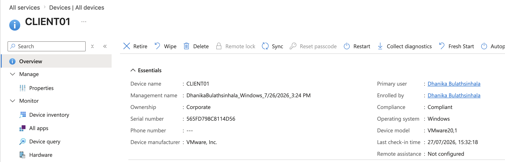
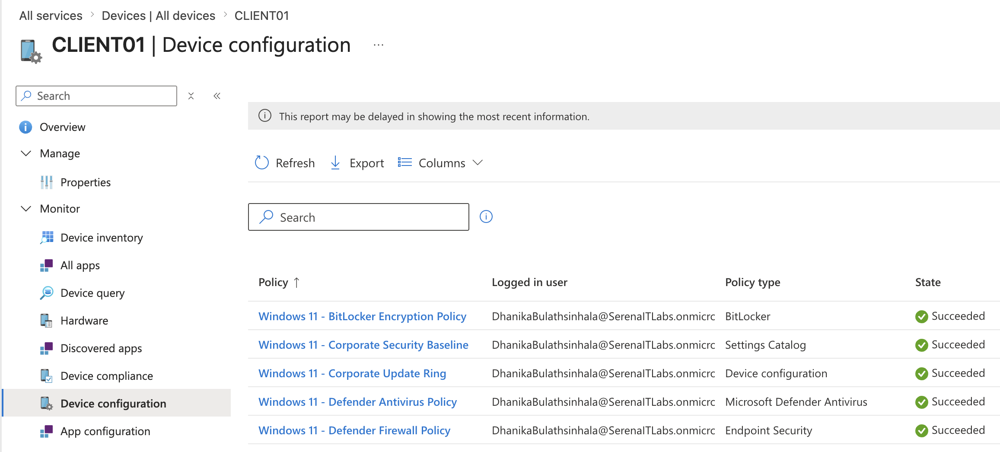
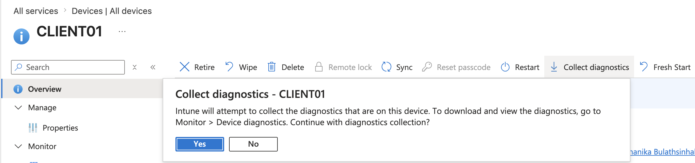
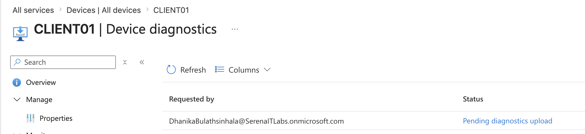
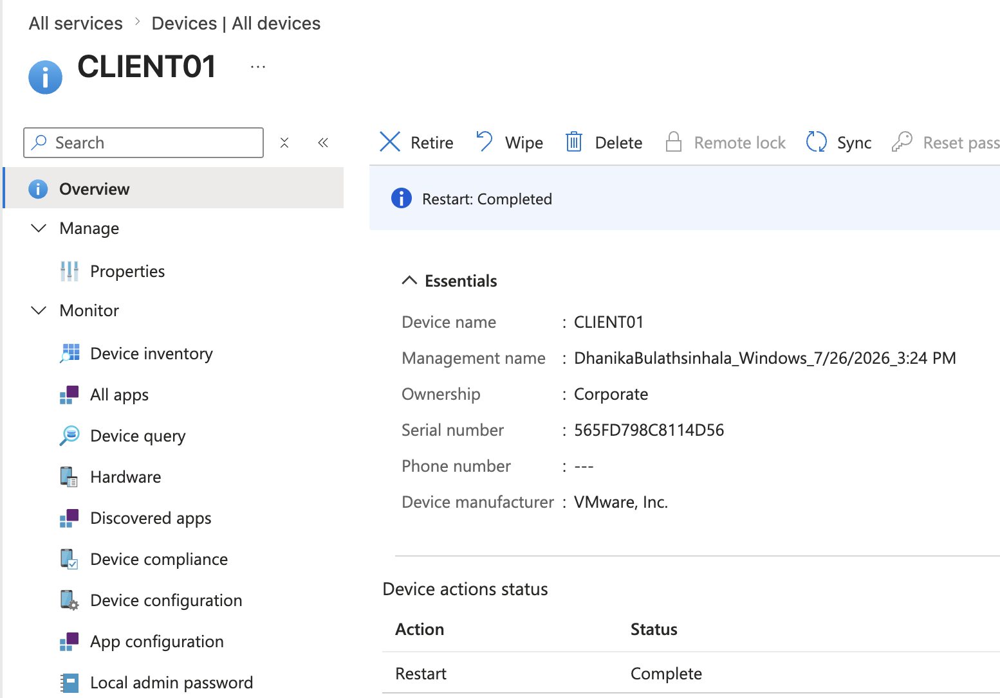

# Project 05 – Device Troubleshooting & Remote Administration

## Overview

This project demonstrates practical Microsoft Intune troubleshooting and remote administration for a managed Windows 11 endpoint.

The lab focused on reviewing device status, checking assigned policies, collecting diagnostic information, and performing a remote restart of `CLIENT01` through the Intune Admin Center.

---

## Scenario

A managed Windows endpoint requires investigation and remote support.

As the Intune administrator, the task was to review the endpoint's management state, inspect policy deployment, collect diagnostics, and perform a remote administrative action without physically accessing the device.

---

## Objectives

- Review managed device information
- Inspect assigned Intune policies
- Collect endpoint diagnostics
- Review diagnostic collection status
- Perform a remote restart
- Demonstrate practical endpoint troubleshooting workflows

---

## Lab Environment

| Component | Details |
|---|---|
| Endpoint | CLIENT01 |
| Operating System | Windows 11 |
| Endpoint Management | Microsoft Intune |
| Identity Platform | Microsoft Entra ID |
| Environment | Microsoft 365 Business Premium Tenant |

---

## Project Structure

```text
05-Device-Troubleshooting-and-Remote-Administration/
├── README.md
└── Screenshots/
    ├── 01_CLIENT01_Device_Overview.png
    ├── 02_CLIENT01_Policy_Status.png
    ├── 03_Collect_Diagnostics_Action.png
    ├── 04_Device_Diagnostics_Status.png
    └── 05_Remote_Restart_Action.png
```

---

## Device Overview

The managed endpoint overview was reviewed to confirm device information and current Intune management state.

Information reviewed included:

- Device name
- Operating system
- Compliance state
- Management status
- Ownership
- Primary user
- Last check-in information



---

## Policy Status Review

The policies assigned to `CLIENT01` were reviewed to determine whether expected configuration and security policies had reached the device.

This is an important troubleshooting step when investigating endpoint configuration or compliance issues.



---

## Diagnostic Collection

A remote diagnostic collection was initiated through Microsoft Intune.

Diagnostic collection can provide administrators with additional endpoint information when investigating device-management or configuration issues.



---

## Diagnostic Status

The diagnostic request was reviewed through Intune to verify the collection process and available diagnostic information.



---

## Remote Restart

A remote restart was initiated for `CLIENT01` through Microsoft Intune.

Remote restart functionality allows administrators to perform basic remediation actions on managed endpoints without requiring physical access to the device.



---

## Troubleshooting Workflow

```text
User / Endpoint Issue
        │
        ▼
Review Device Overview
        │
        ▼
Check Assigned Policies
        │
        ▼
Collect Diagnostics
        │
        ▼
Review Diagnostic Status
        │
        ▼
Perform Remote Remediation
```

---

## Skills Demonstrated

- Microsoft Intune administration
- Endpoint troubleshooting
- Managed device monitoring
- Policy status review
- Remote diagnostic collection
- Device diagnostics
- Remote restart
- Endpoint remediation
- Windows 11 device administration
- Remote support workflows

---

## Lessons Learned

- Intune provides centralized visibility into managed Windows endpoints.
- Device overview information is useful when beginning an endpoint investigation.
- Policy status should be reviewed when troubleshooting configuration or compliance issues.
- Diagnostic collection provides additional information for endpoint investigations.
- Remote administrative actions can help resolve endpoint issues without physical access.
- Intune supports practical remote-support workflows commonly used by endpoint and IT support teams.

---

## Next Project

**Project 06 – macOS MDM, Security & Compliance**

The next project focuses on enrolling and managing a macOS device through Microsoft Intune, applying configuration and security policies, and verifying compliance.

---

**Status:** Completed