# Project 06 – macOS MDM, Security & Compliance

## Overview

This project demonstrates the enrollment, configuration, security management, and compliance evaluation of a macOS endpoint using Microsoft Intune.

A personal MacBook Air was enrolled into Intune through Microsoft Company Portal, targeted with macOS configuration and compliance policies, and protected using an Intune-managed FileVault encryption policy.

After completing and documenting the lab, the Mac was safely unenrolled from Intune and the management profile was removed.

---

## Scenario

An organization requires centralized management of both Windows and macOS endpoints.

As the Intune administrator, the objective was to enroll a macOS device, deploy baseline configuration settings, evaluate device compliance, configure FileVault encryption, and verify policy deployment through Microsoft Intune.

This project extends the endpoint-management portfolio beyond Windows and demonstrates cross-platform MDM administration.

---

## Objectives

- Configure Apple MDM prerequisites for Microsoft Intune
- Enroll a macOS device using Company Portal
- Verify macOS device management in Intune
- Create a macOS device security group
- Deploy a macOS configuration profile
- Configure passcode and screen-lock controls
- Create and deploy a macOS compliance policy
- Verify macOS compliance status
- Configure FileVault through Intune
- Assign FileVault using device-group targeting
- Verify FileVault policy deployment
- Safely unenroll a personally owned macOS device after testing

---

## Lab Environment

| Component | Details |
|---|---|
| Device | MacBook Air |
| Platform | macOS |
| Processor | Apple Silicon |
| Endpoint Management | Microsoft Intune |
| Enrollment | Microsoft Company Portal |
| Apple Management Prerequisite | Apple MDM Push Certificate |
| Identity Platform | Microsoft Entra ID |
| Device Group | Intune-macOS-Devices |
| Disk Encryption | FileVault |
| Environment | Microsoft 365 Business Premium Tenant |

---

## Project Structure

```text
06-macOS-MDM-Security-and-Compliance/
├── README.md
└── Screenshots/
    ├── 01_macOS_Device_Enrolled.png
    ├── 02_macOS_Device_Overview.png
    ├── 03_macOS_Configuration_Settings.png
    ├── 04_macOS_Configuration_Assignment.png
    ├── 05_macOS_Configuration_Status.png
    ├── 06_macOS_Compliance_Settings.png
    ├── 07_macOS_Compliance_Assignment.png
    ├── 08_macOS_Compliance_Status.png
    ├── 09_macOS_FileVault_Settings.png
    ├── 10_macOS_FileVault_Assignment.png
    └── 11_macOS_FileVault_Status.png
```

---

# macOS Enrollment

## Apple MDM Configuration

Microsoft Intune requires an Apple MDM Push Certificate before Apple devices can be managed.

The Apple MDM Push Certificate was configured within the Intune tenant before macOS enrollment.

---

## Device Enrollment

The MacBook was enrolled using Microsoft Company Portal and the required macOS management profile.

After enrollment, the device appeared in the Intune managed-device inventory.

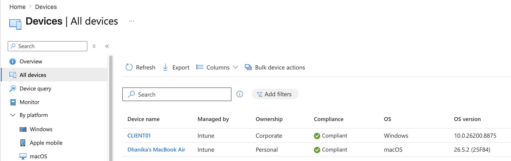

---

## Managed Device Overview

The enrolled MacBook was reviewed through Microsoft Intune to verify its management state and device information.

Information available included:

- Device model
- Operating system
- Ownership
- Compliance state
- Intune management status
- Last check-in

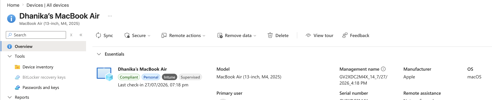

---

# macOS Configuration Management

## Device Group

A Microsoft Entra security group named:

`Intune-macOS-Devices`

was created.

The enrolled MacBook was added as a device member and the group was used for macOS policy targeting.

---

## Configuration Profile

A macOS Settings Catalog profile named:

`macOS - Corporate Configuration`

was created.

The profile included baseline controls related to:

- Passcode requirements
- Minimum passcode length
- Failed authentication attempts
- Screen-lock and screensaver security

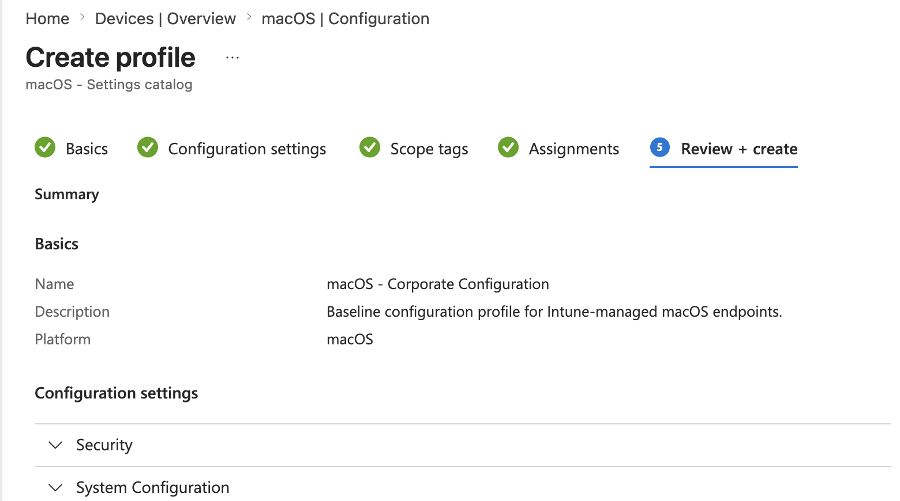

---

## Configuration Assignment

The configuration profile was assigned to:

`Intune-macOS-Devices`

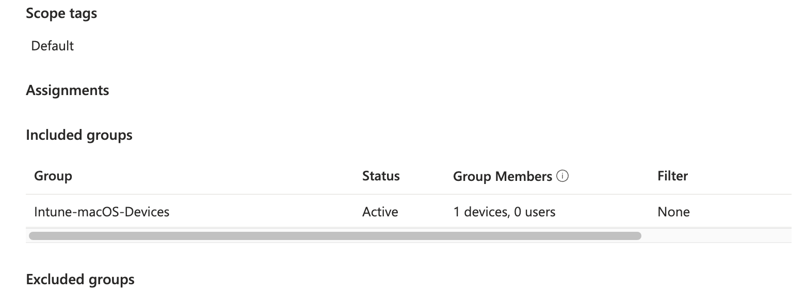

---

## Configuration Verification

Following a device check-in, the macOS configuration profile successfully applied to the managed Mac.

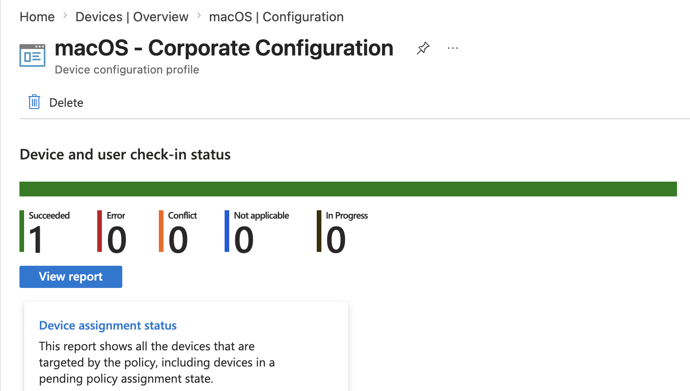

---

# macOS Compliance Management

## Compliance Policy

A macOS compliance policy was created to evaluate the endpoint against organizational security requirements.

Configured requirements included controls such as:

- Password protection
- Password complexity
- System Integrity Protection
- Firewall requirements where applicable

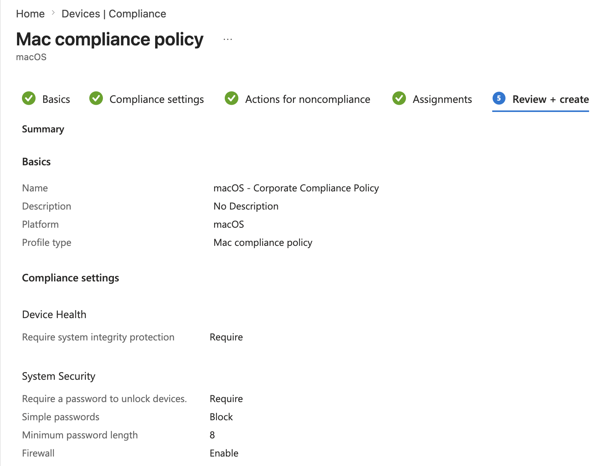

---

## Compliance Assignment

The compliance policy was assigned to:

`Intune-macOS-Devices`

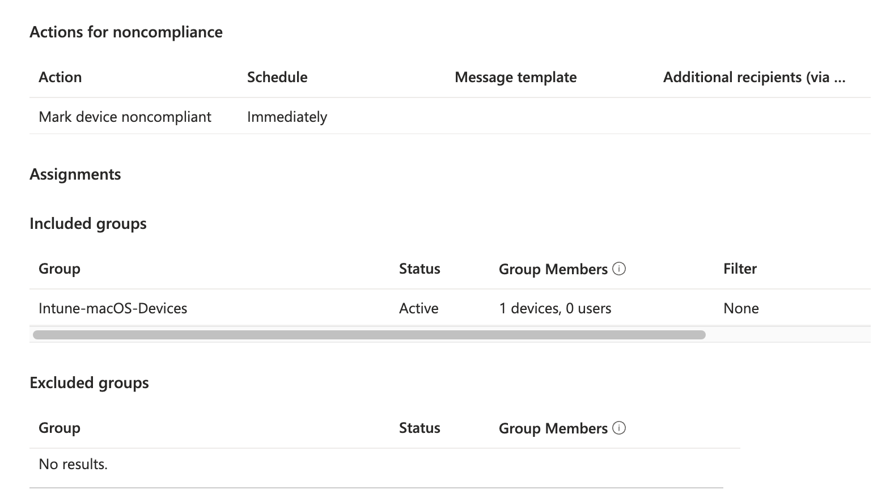

---

## Compliance Verification

After synchronization and evaluation, the managed Mac successfully reported as compliant.

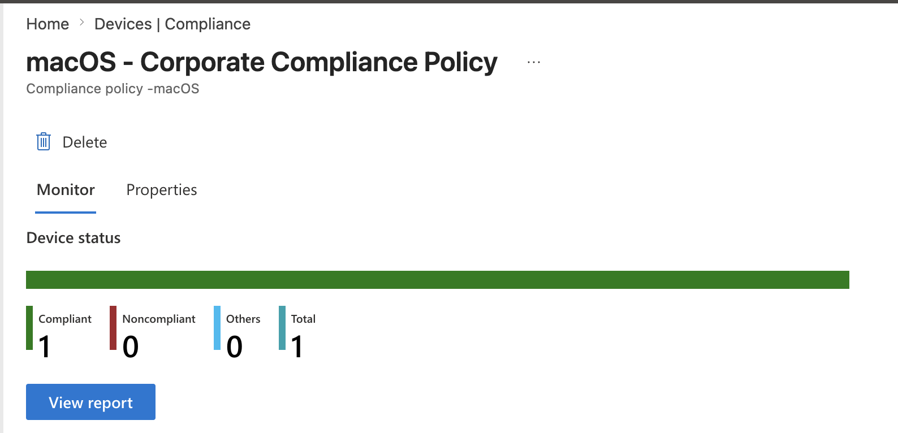

---

# FileVault Disk Encryption

## FileVault Policy

A macOS FileVault encryption policy was created through:

`Endpoint security → Disk encryption`

The policy enabled FileVault and configured recovery-key functionality for the managed endpoint.

Configured settings included:

- FileVault enabled
- Deferred enablement
- User-login enforcement
- Personal recovery key
- Recovery-key visibility
- Recovery-key rotation

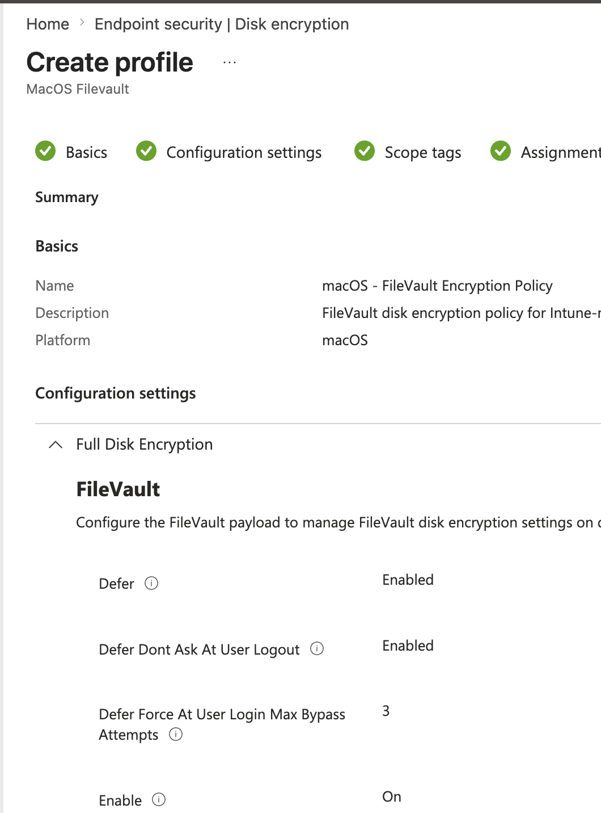

---

## FileVault Assignment

The FileVault policy was assigned to:

`Intune-macOS-Devices`

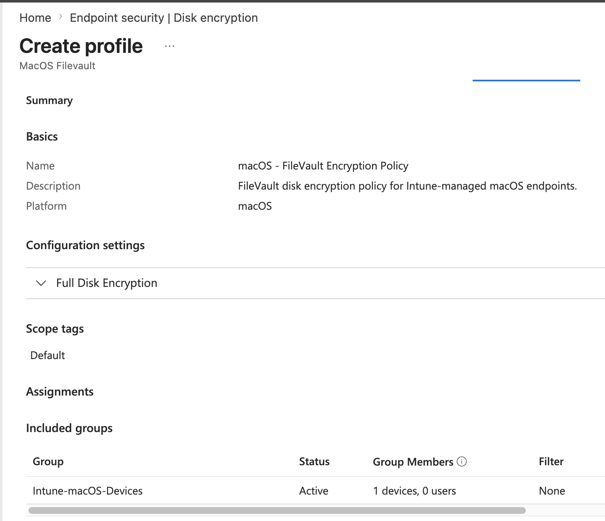

---

## FileVault Deployment Status

The FileVault policy deployment was monitored through Microsoft Intune.

The managed Mac successfully received the encryption policy.

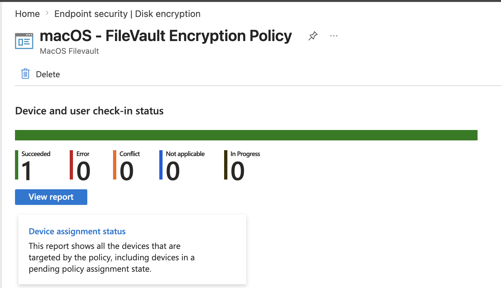

---

# Cross-Platform Endpoint Management

This project complements the Windows Intune projects by demonstrating management of a second endpoint platform.

```text
Microsoft Intune
      │
      ├── Windows 11
      │     ├── Enrollment
      │     ├── Configuration
      │     ├── Compliance
      │     ├── Applications
      │     └── Endpoint Security
      │
      └── macOS
            ├── Enrollment
            ├── Configuration
            ├── Compliance
            └── FileVault
```

---

## Lab Cleanup

Because the enrolled MacBook was a personally owned device, the Intune management relationship was removed after completing the lab.

The cleanup process included:

1. Verifying FileVault recovery information.
2. Removing the Mac from Company Portal management.
3. Confirming the Intune management profile was removed from macOS.
4. Verifying normal local access remained available.

No remote wipe or factory-reset action was used.

---

## Skills Demonstrated

- Microsoft Intune macOS administration
- Apple MDM Push Certificate configuration
- Microsoft Company Portal enrollment
- macOS MDM enrollment
- Microsoft Entra device groups
- Group-based policy targeting
- macOS Settings Catalog
- Passcode configuration
- Screen-lock security
- macOS compliance policies
- System Integrity Protection awareness
- macOS firewall compliance
- FileVault disk encryption
- FileVault recovery-key management
- Endpoint policy deployment
- Device compliance monitoring
- Cross-platform endpoint management
- Safe MDM unenrollment

---

## Lessons Learned

- Apple devices require an Apple MDM Push Certificate before Intune can manage them.
- Company Portal provides a practical enrollment method for personally owned macOS devices.
- Security groups allow macOS policies to be assigned consistently to managed endpoints.
- Intune Settings Catalog provides centralized configuration management for macOS.
- Compliance policies provide visibility into whether endpoints meet organizational security requirements.
- FileVault can be centrally configured through Intune to protect data stored on macOS devices.
- FileVault encryption and Intune management are separate; removing Intune management does not necessarily disable disk encryption.
- Recovery information should be retained securely while FileVault remains enabled.
- A personally owned device can be safely unenrolled without using destructive remote-management actions.
- Intune provides a common management platform for both Windows and macOS endpoints.

---

## Next Project

**Project 07 – Windows Autopilot**

The final Intune portfolio project focuses on modern Windows provisioning using Windows Autopilot, deployment profiles, device registration, and automated endpoint onboarding.

---

**Status:** Completed