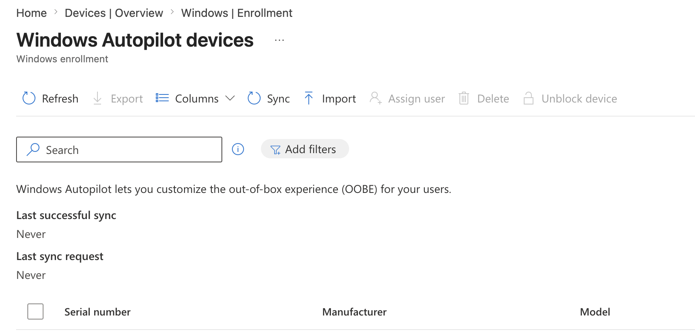
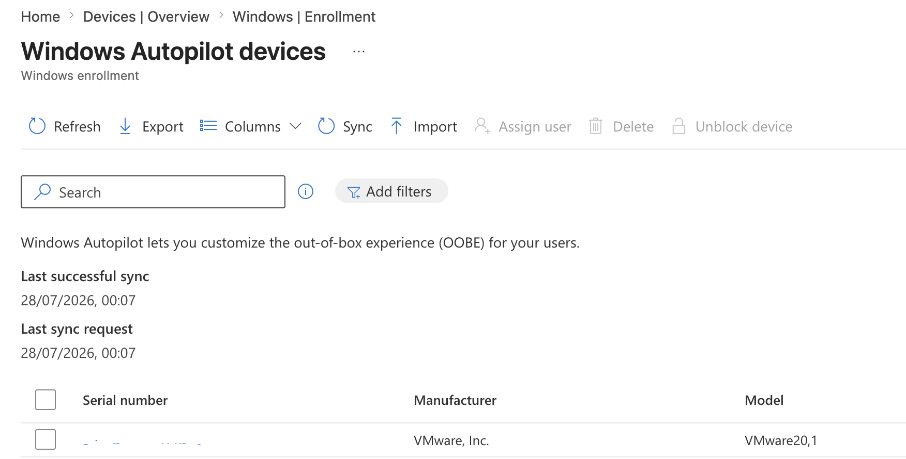
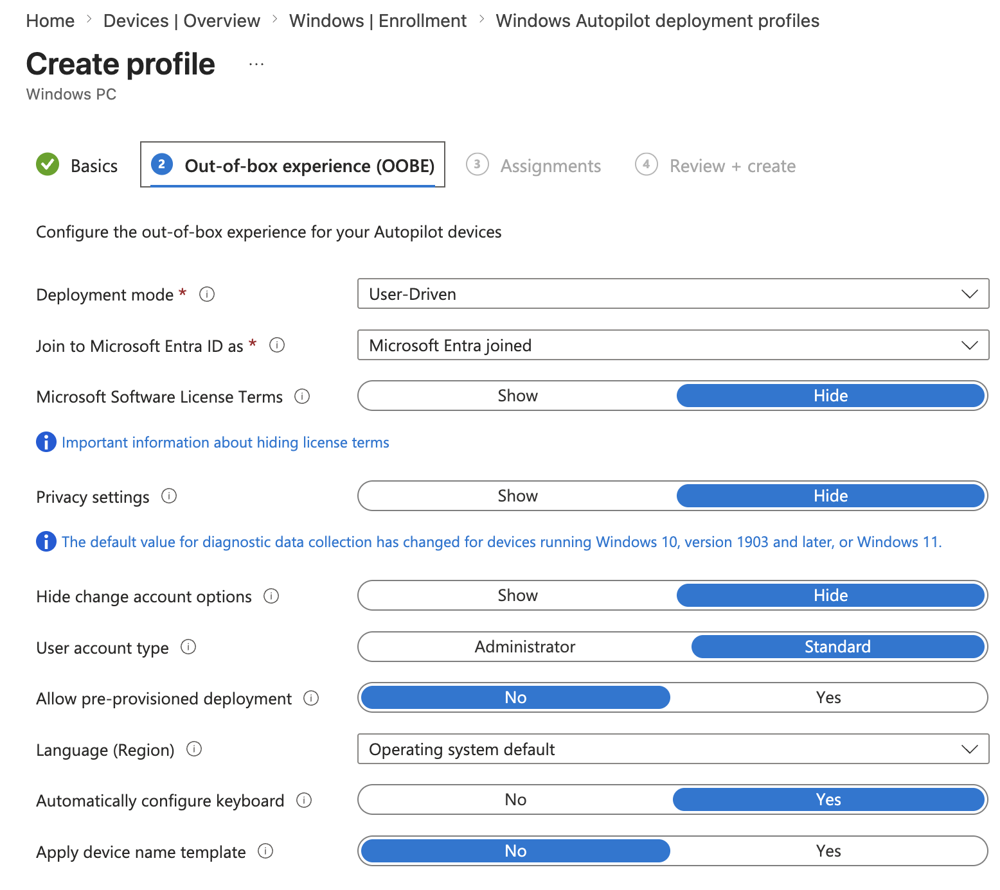
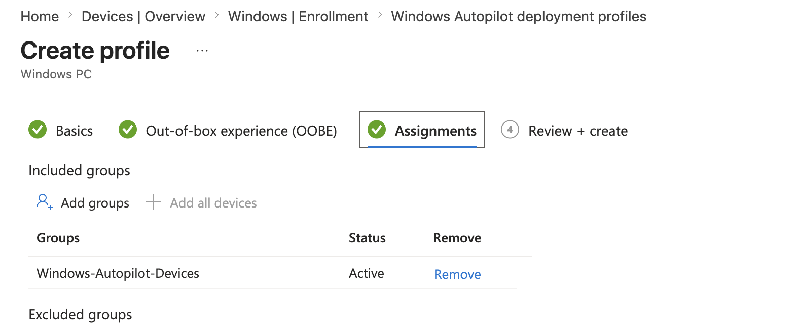
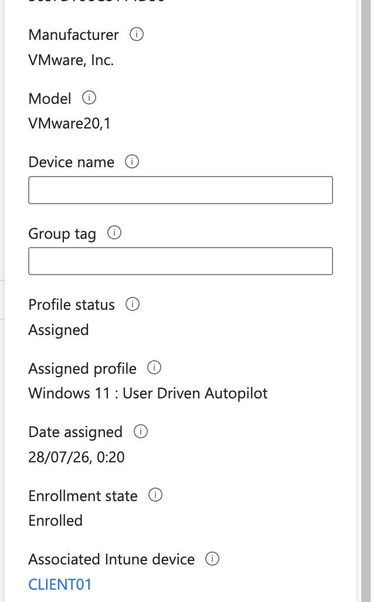
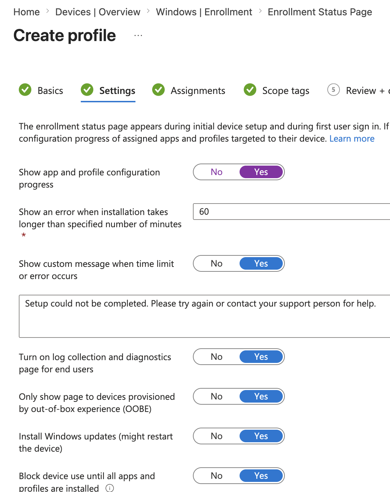
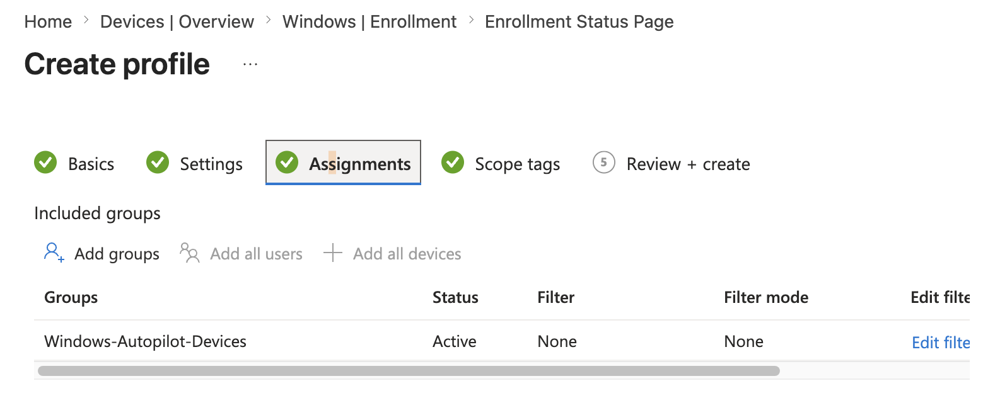
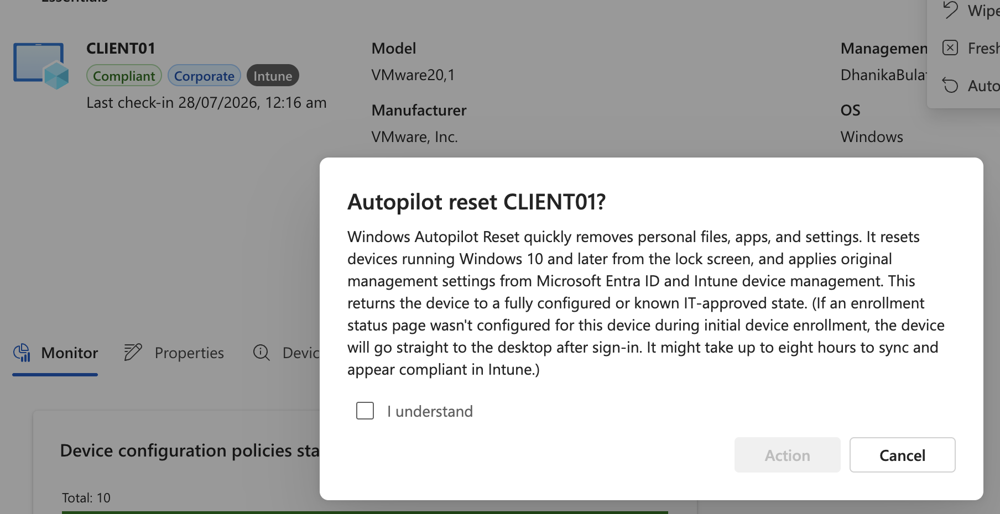
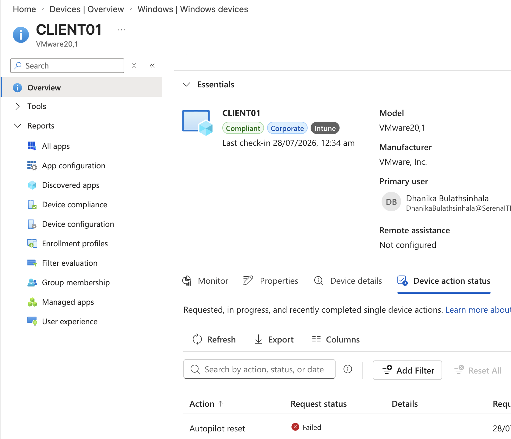

# Project 07 – Windows Autopilot

## Overview

This project demonstrates Windows Autopilot configuration and modern Windows device provisioning using Microsoft Intune and Microsoft Entra ID.

The lab included collecting and importing a Windows device hardware hash, registering the endpoint with Windows Autopilot, creating a user-driven deployment profile, configuring an Enrollment Status Page (ESP), assigning Autopilot resources through a device group, and testing the configuration through Windows Out-of-Box Experience (OOBE).

The lab also included troubleshooting an unsuccessful remote Autopilot Reset.

---

## Scenario

An organization requires a standardized method for provisioning Windows endpoints without manually configuring each device.

As the Intune administrator, the objective was to register a Windows 11 endpoint with Windows Autopilot and configure a user-driven provisioning experience that could automatically apply organizational identity and management settings during Windows setup.

---

## Objectives

- Collect a Windows Autopilot hardware hash
- Import a device into Windows Autopilot
- Verify Autopilot registration
- Create an Autopilot device group
- Configure a user-driven deployment profile
- Configure Microsoft Entra Join
- Assign the deployment profile
- Configure an Enrollment Status Page
- Test remote Autopilot Reset
- Troubleshoot an unsuccessful reset
- Return Windows to OOBE
- Verify organizational Autopilot recognition during Windows setup

---

## Lab Environment

| Component | Details |
|---|---|
| Endpoint | CLIENT01 |
| Operating System | Windows 11 |
| Virtualization | VMware Fusion |
| Endpoint Management | Microsoft Intune |
| Identity Platform | Microsoft Entra ID |
| Provisioning | Windows Autopilot |
| Deployment Mode | User-driven |
| Join Type | Microsoft Entra joined |
| Autopilot Group | Windows-Autopilot-Devices |

---

## Project Structure

```text
07-Windows-Autopilot/
├── README.md
└── Screenshots/
    ├── 01_Autopilot_Devices_Before_Registration.png
    ├── 02_CLIENT01_Autopilot_Registered.png
    ├── 03_Autopilot_Deployment_Profile_Settings.png
    ├── 04_Autopilot_Profile_Assignment.png
    ├── 05_CLIENT01_Autopilot_Profile_Assigned.png
    ├── 06_Autopilot_ESP_Settings.png
    ├── 07_Autopilot_ESP_Assignment.png
    ├── 08_Autopilot_Reset_Failed.png
    └── 09_Autopilot_Organization_SignIn.png
```

---

# Windows Autopilot Registration

## Initial Autopilot Inventory

The Windows Autopilot device inventory was reviewed before registration to establish the initial state of the environment.



---

## Hardware Hash Collection

The Windows Autopilot hardware information for `CLIENT01` was collected using PowerShell.

A working directory was created:

```powershell
New-Item -Type Directory -Path "C:\HWID"
Set-Location -Path "C:\HWID"
```

The Windows Autopilot information script was installed:

```powershell
Install-Script -Name Get-WindowsAutopilotInfo
```

The hardware information was exported:

```powershell
Get-WindowsAutopilotInfo -OutputFile AutopilotHWID.csv
```

The resulting CSV contained the hardware information required to register the endpoint with Windows Autopilot.

---

## Autopilot Device Registration

The generated hardware information CSV was imported into Windows Autopilot through Microsoft Intune.

Following synchronization, `CLIENT01` appeared in the Windows Autopilot device inventory.



---

# Autopilot Deployment Profile

## User-Driven Deployment

A Windows Autopilot deployment profile named:

`Windows 11 - User Driven Autopilot`

was created.

The profile was configured for:

```text
Deployment mode: User-driven
Join type: Microsoft Entra joined
User account type: Standard
Microsoft Software License Terms: Hidden
Privacy settings: Hidden
```

This configuration represents a modern corporate Windows provisioning workflow in which the end user authenticates using an organizational account during device setup.



---

## Autopilot Device Group

A Microsoft Entra security group named:

`Windows-Autopilot-Devices`

was created for Autopilot targeting.

`CLIENT01` was added as a device member.

---

## Deployment Profile Assignment

The Autopilot deployment profile was assigned to:

`Windows-Autopilot-Devices`



---

## Profile Assignment Verification

The Autopilot device inventory was reviewed to confirm that the deployment profile had been associated with `CLIENT01`.



---

# Enrollment Status Page

## ESP Configuration

A dedicated Enrollment Status Page profile was created:

`Windows 11 - Autopilot ESP`

The ESP was configured to provide visibility into device provisioning and to control access to the endpoint while required setup activities were being processed.

Configured options included:

- Display application and profile configuration progress
- Display setup errors
- Allow collection of installation logs
- Apply the page during OOBE provisioning
- Block device access while required provisioning activities are processed



---

## ESP Assignment

The Enrollment Status Page profile was assigned to:

`Windows-Autopilot-Devices`



---

# Autopilot Testing and Troubleshooting

## Remote Autopilot Reset

A remote Autopilot Reset was initiated through Microsoft Intune to test device reprovisioning.

The action was received by Intune but ultimately reported a failed status.



Rather than representing the reset as successful, the failure was retained as troubleshooting evidence.

Device prerequisites were reviewed, including:

```text
Microsoft Entra Join
Intune enrollment
Windows Recovery Environment
Autopilot registration
Deployment profile assignment
```

The device reported the expected Microsoft Entra and management state, while Windows Recovery Environment was also enabled.

---

## Sysprep Troubleshooting

Windows System Preparation was subsequently used to return the lab endpoint to the Windows Out-of-Box Experience.

Sysprep logs were examined under:

```text
C:\Windows\System32\Sysprep\Panther\
```

The logs confirmed that the generalization process completed successfully but the subsequent shutdown operation encountered an error.

The endpoint was manually shut down after confirming successful Sysprep generalization.

On the next boot, Windows successfully entered OOBE.

---

# Autopilot OOBE Verification

During Windows OOBE, the endpoint was connected to the internet.

Because the device hardware was registered with Windows Autopilot and had an assigned deployment profile, Windows presented the organizational sign-in experience.

This demonstrated that the Autopilot service recognized the registered endpoint during OOBE.



The lab therefore successfully demonstrated Autopilot registration, profile targeting, ESP configuration, and organizational recognition during OOBE. A complete successful ESP provisioning cycle was not documented and is therefore not claimed as an outcome of this project.

---

## Autopilot Workflow

```text
CLIENT01
    │
    ▼
Hardware Hash Collection
    │
    ▼
Autopilot Registration
    │
    ▼
Windows-Autopilot-Devices
    │
    ├── Deployment Profile
    │
    └── Enrollment Status Page
    │
    ▼
Windows OOBE
    │
    ▼
Autopilot Service Recognition
    │
    ▼
Organizational Sign-In
```

---

## Skills Demonstrated

- Windows Autopilot
- Microsoft Intune administration
- Microsoft Entra ID
- Windows hardware hash collection
- PowerShell
- Autopilot device registration
- Device-group targeting
- User-driven Autopilot deployment
- Microsoft Entra Join configuration
- Enrollment Status Page configuration
- Windows OOBE
- Autopilot profile assignment
- Remote device actions
- Autopilot troubleshooting
- Sysprep troubleshooting
- Windows provisioning
- Modern endpoint deployment

---

## Lessons Learned

- Windows Autopilot identifies registered devices using hardware information.
- Hardware hashes can be collected and imported for existing lab devices.
- Autopilot deployment profiles define how registered Windows endpoints are provisioned during OOBE.
- Device groups provide scalable targeting for Autopilot profiles.
- The Enrollment Status Page controls and reports aspects of the provisioning experience.
- Autopilot registration and Autopilot Reset are separate functions.
- A failed remote reset does not necessarily indicate failed Autopilot registration.
- Sysprep logs provide useful evidence when troubleshooting Windows generalization.
- Reaching the organizational sign-in experience during OOBE provides evidence that the registered device was recognized by the Autopilot service.
- Successful configuration should not be confused with successful end-to-end provisioning; deployment outcomes should be documented accurately.

---

## Project Outcome

`CLIENT01` was successfully registered with Windows Autopilot and targeted with a user-driven deployment profile and Enrollment Status Page configuration.

The endpoint subsequently reached Windows OOBE and displayed the organizational sign-in experience associated with the Autopilot deployment.

The remote Autopilot Reset attempt failed and was documented as a troubleshooting case rather than presented as a successful deployment.

---

**Status:** Completed